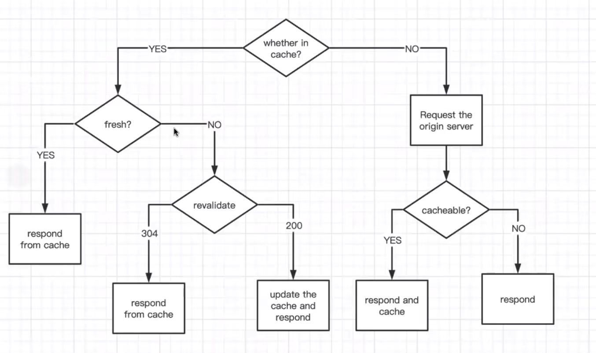

# ECE568-project2-HTTP_Caching_Proxy

Team Member: 
Yingxu Wang yw473 
Yiling Han yh317 

Project Intro: 
In this project, users can visit a website using the proxy we create. 
Types of request we accept: GET, POST and CONNECT 
If a website response is cacheable, we may store it in the cache for future use. 

Project Idea: (Procedure image was retrived from one TA) 
 

In your browser proxy setting, set proxy: 
proxy address 
proxy ports(12345) 

Note: 
-Websites we have tested are inside the directory: ./docker_deploy/src/hw2/test_website.txt 
-Corresponding logs are inside the directory: ./docker_deploy/src/hw2/test_log.log 

**Enter these commands in order to start:**[**!important**] 
1. 
sudo chmod 777 -R .  
2.  
sudo docker-compose up
